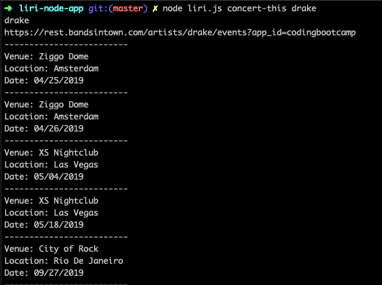

# LIRI BOT APPLICATION (A Language Interpretation and Recognition Interface)

## Description
LIRI is a command line node application that takes in parameters and gives you back information based on those parameters. The parameters are as following: 

-	concert-this
-	Spotify-this-song
-	movie-this
-	do-what-it-says

## concert-this:

