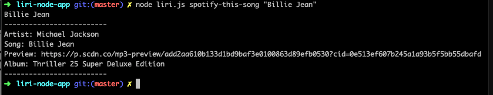
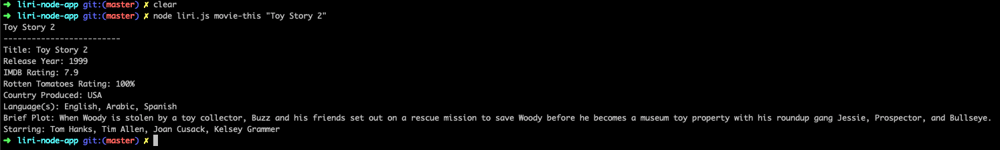
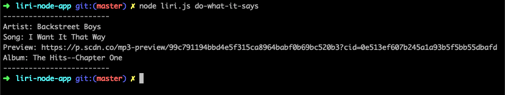

# LIRI BOT APPLICATION (A Language Interpretation and Recognition Interface)

## Description
LIRI is a command line node application that takes in parameters and gives you back information based on those parameters. The parameters are as following: 

-	concert-this
-	Spotify-this-song
-	movie-this
-	do-what-it-says

## concert-this:

This will search the Bands in Town Artist Events API for the artist searched for and render the following information about each event:

-	Name of the venue
-	Venue location
-	Date of the Event

## spotify-this-song: 

This will use the spotify node module and search spotify for the specific song searched for. After finding the song, the following information will be displayed: 

-	Artist(s)
-	The song's name
-	A preview link of the song from Spotify
-	The album that the song is from

## movie-this: 

This will search the OMDB API and output the following information about the movie searched:
-	Title of the movie.
-	Year the movie came out.
-	IMDB Rating of the movie.
-	Rotten Tomatoes Rating of the movie.
-	Country where the movie was produced.
-	Language of the movie.
-	Plot of the movie.
-	Actors in the movie.

## do-what-it-says: 

LIRI will use the text from “random.txt” and call on one of LIRI’s commands. 
It should run Spotify-this-song for “I want it That way”. 

## APIs and Technologies used:

* Javascript
* Node.js
* OMDB API
* Bands In Town API
* Spotify API
* AXIOS Node Module
* Spotify Node Module
* Moment.js
* fs Node Module
* dotenv Node Module

